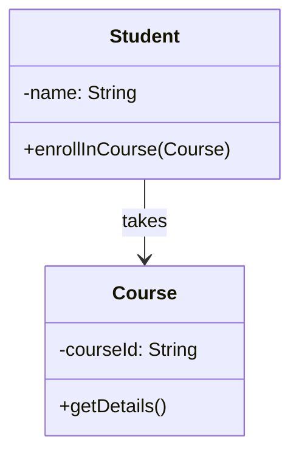
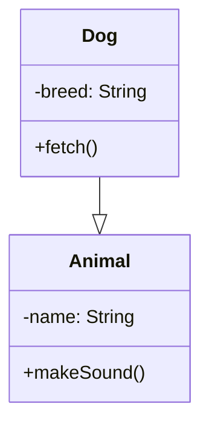
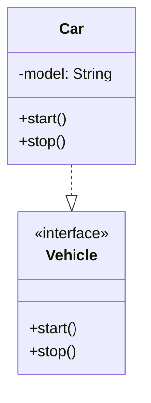
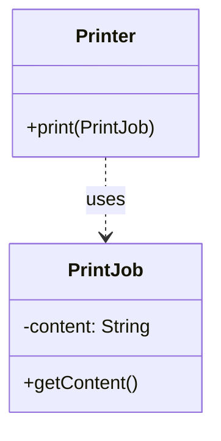
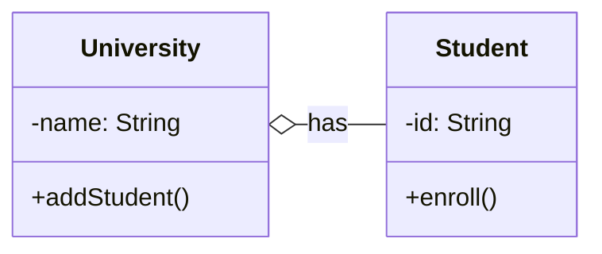
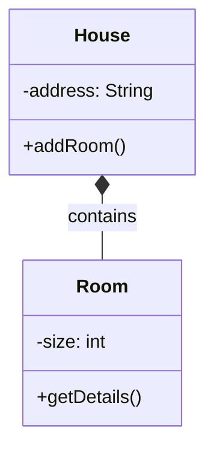

## Relationships

# 1. Association
**Description**: Basic relationship where one class uses another class in some way
**Example**: A Student takes Courses



# 2. Inheritance
**Description**: "is-a" relationship where child class inherits from parent class
**Example**: Dog is an Animal



# 3. Implementation
**Description**: A class implements an interface (dashed arrow)
**Example**: Car implements Vehicle interface



# 4. Dependency
**Description**: Weaker relationship where one class temporarily uses another
**Example**: Printer depends on PrintJob for printing



# 5. Aggregation
**Description**: "has-a" relationship where parts can exist independently of the whole
**Example**: University has Students, but Students can exist without University



# 6. Composition
**Description**: Strong "has-a" relationship where parts cannot exist without the whole
**Example**: House has Rooms, Rooms cannot exist without House



Key differences:
- Association is a general "uses" relationship
- Inheritance shows an "is-a" relationship
- Implementation shows interface fulfillment
- Dependency is a weak, temporary usage
- Aggregation shows containment where parts can exist independently
- Composition shows containment where parts cannot exist independently


## Functional Interfaces

```java
// 1. Function<T,R> - Transform input to different output
Function<String, Integer> lengthFn = str -> str.length();
// Usage: lengthFn.apply("hello") -> 5

// 2. Consumer<T> - Accept input, return nothing
Consumer<String> printer = msg -> System.out.println(msg);
// Usage: printer.accept("hi") -> prints "hi"

// 3. Predicate<T> - Test input, return boolean
Predicate<String> isEmpty = str -> str.length() == 0;
// Usage: isEmpty.test("") -> true

// 4. Supplier<T> - Supply value without input
Supplier<String> greeter = () -> "hello";
// Usage: greeter.get() -> "hello"
```

## `extends`

The wildcard declaration of `List<? extends Number> foo3` means that any of these are legal assignments:

```java
List<? extends Number> foo3 = new ArrayList<Number>();  // Number "extends" Number (in this context)
List<? extends Number> foo3 = new ArrayList<Integer>(); // Integer extends Number
List<? extends Number> foo3 = new ArrayList<Double>();  // Double extends Number
```

1. **Reading** - Given the above possible assignments, what type of object are you guaranteed to read from `List foo3`:
   * You can read a **`Number`** because any of the lists that could be assigned to `foo3` contain a `Number` or a subclass of `Number`.
   * You can't read an `Integer` because `foo3` could be pointing at a `List<Double>`.
   * You can't read a `Double` because `foo3` could be pointing at a `List<Integer>`.

2. **Writing** - Given the above possible assignments, what type of object could you add to `List foo3` that would be legal for **all** the above possible `ArrayList` assignments:
   * You can't add an `Integer` because `foo3` could be pointing at a `List<Double>`.
   * You can't add a `Double` because `foo3` could be pointing at a `List<Integer>`.
   * You can't add a `Number` because `foo3` could be pointing at a `List<Integer>`.

*You can't add any object to `List<? extends T>` because you can't guarantee what kind of `List` it is really pointing to, so you can't guarantee that the object is allowed in that `List`. The only "guarantee" is that you can only read from it and you'll get a `T` or subclass of `T`.*

## `super`

Now consider `List <? super T>`.

The wildcard declaration of `List<? super Integer> foo3` means that any of these are legal assignments:

```java
List<? super Integer> foo3 = new ArrayList<Integer>();  // Integer is a "superclass" of Integer (in this context)
List<? super Integer> foo3 = new ArrayList<Number>();   // Number is a superclass of Integer
List<? super Integer> foo3 = new ArrayList<Object>();   // Object is a superclass of Integer
```

1. **Reading** - Given the above possible assignments, what type of object are you guaranteed to receive when you read from `List foo3`:
   * You aren't guaranteed an `Integer` because `foo3` could be pointing at a `List<Number>` or `List<Object>`.
   * You aren't guaranteed a `Number` because `foo3` could be pointing at a `List<Object>`.
   * The **only** guarantee is that you will get an instance of an **`Object`** or subclass of `Object` (but you don't know what subclass).

2. **Writing** - Given the above possible assignments, what type of object could you add to `List foo3` that would be legal for **all** the above possible `ArrayList` assignments:
   * You can add an `Integer` because an `Integer` is allowed in any of above lists.
   * You can add an instance of a subclass of `Integer` because an instance of a subclass of `Integer` is allowed in any of the above lists.
   * You can't add a `Double` because `foo3` could be pointing at an `ArrayList<Integer>`.
   * You can't add a `Number` because `foo3` could be pointing at an `ArrayList<Integer>`.
   * You can't add an `Object` because `foo3` could be pointing at an `ArrayList<Integer>`.

## PECS

Remember *PECS*: **"Producer Extends, Consumer Super"**.

* **"Producer Extends"** - If you need a `List` to produce `T` values (you want to read `T`s from the list), you need to declare it with `? extends T`, e.g. `List<? extends Integer>`. But you cannot add to this list.

* **"Consumer Super"** - If you need a `List` to consume `T` values (you want to write `T`s into the list), you need to declare it with `? super T`, e.g. `List<? super Integer>`. But there are no guarantees what type of object you may read from this list.

* If you need to both read from and write to a list, you need to declare it exactly with no wildcards, e.g. `List<Integer>`.
