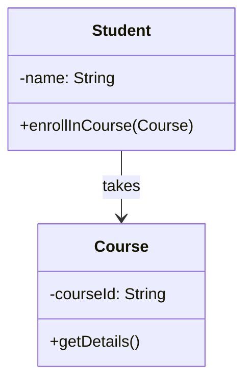
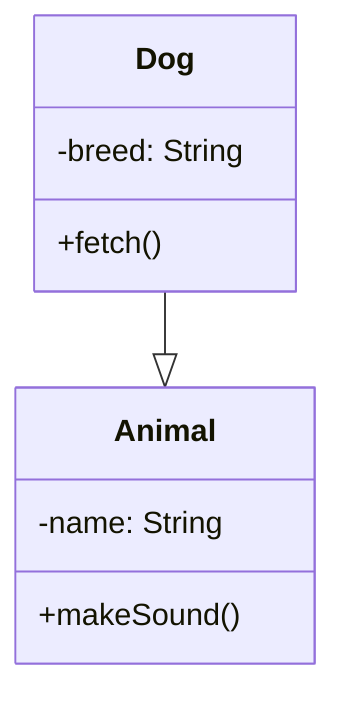
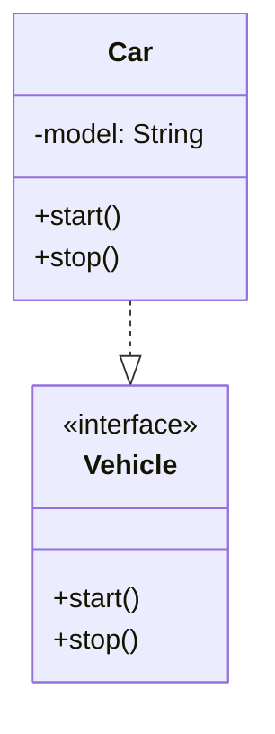
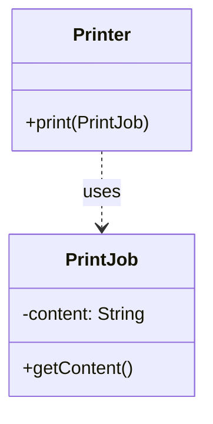
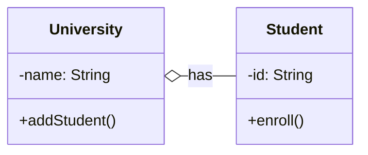
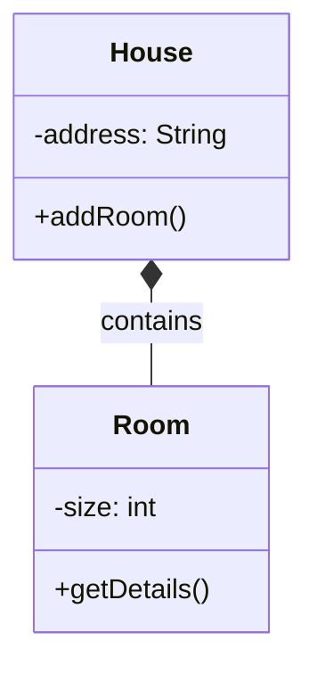

## Relationships

# 1. Association
**Description**: Basic relationship where one class uses another class in some way
**Example**: A Student takes Courses



# 2. Inheritance
**Description**: "is-a" relationship where child class inherits from parent class
**Example**: Dog is an Animal



# 3. Implementation
**Description**: A class implements an interface (dashed arrow)
**Example**: Car implements Vehicle interface



# 4. Dependency
**Description**: Weaker relationship where one class temporarily uses another
**Example**: Printer depends on PrintJob for printing



# 5. Aggregation
**Description**: "has-a" relationship where parts can exist independently of the whole
**Example**: University has Students, but Students can exist without University



# 6. Composition
**Description**: Strong "has-a" relationship where parts cannot exist without the whole
**Example**: House has Rooms, Rooms cannot exist without House



Key differences:
- Association is a general "uses" relationship
- Inheritance shows an "is-a" relationship
- Implementation shows interface fulfillment
- Dependency is a weak, temporary usage
- Aggregation shows containment where parts can exist independently
- Composition shows containment where parts cannot exist independently


## Functional Interfaces

```java
// 1. Function<T,R> - Transform input to different output
Function<String, Integer> lengthFn = str -> str.length();
// Usage: lengthFn.apply("hello") -> 5

// 2. Consumer<T> - Accept input, return nothing
Consumer<String> printer = msg -> System.out.println(msg);
// Usage: printer.accept("hi") -> prints "hi"

// 3. Predicate<T> - Test input, return boolean
Predicate<String> isEmpty = str -> str.length() == 0;
// Usage: isEmpty.test("") -> true

// 4. Supplier<T> - Supply value without input
Supplier<String> greeter = () -> "hello";
// Usage: greeter.get() -> "hello"
```
