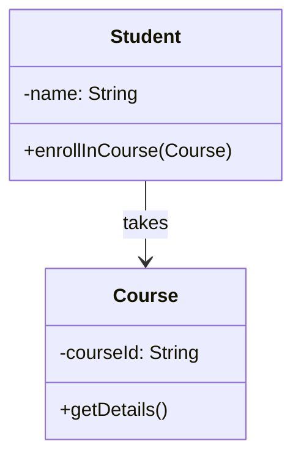
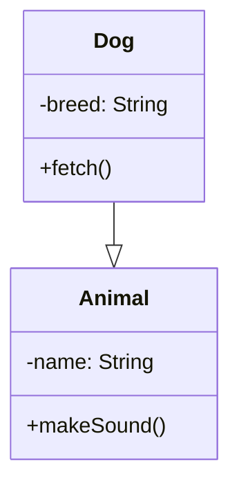
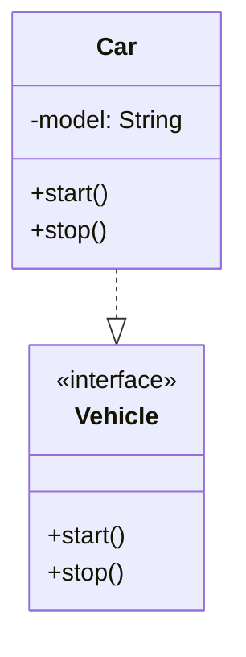
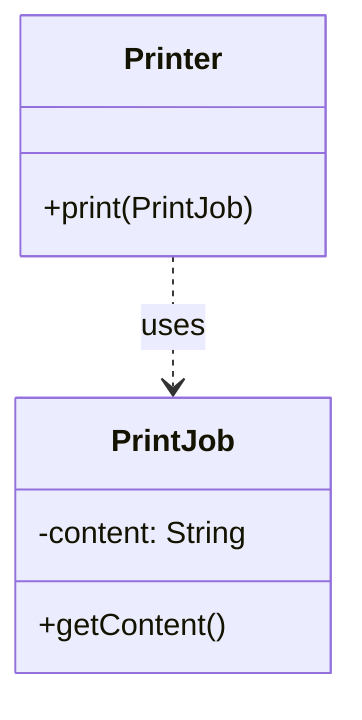
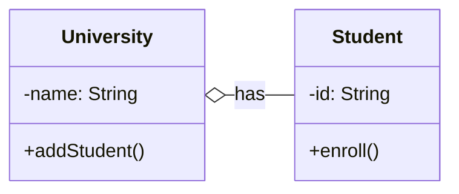
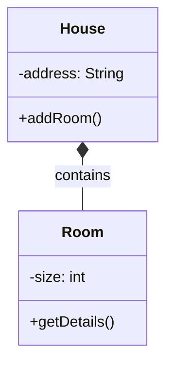

<script setup>
import Editor from '../components/Editor.vue'
</script>

# Multiple Choice Practice Questions

## Question 1

On a bike, there are one or more tyres.

The following relationship is an example of:

A) Aggregation \
B) Composition \
C) Neither

<Editor storageKey="24T1-q1" />

::: details Solution
A) Aggregation

The `Bicycle` class is an aggregation of the `Tyre` class.


### 1. Association
**Description**: Basic relationship where one class uses another class in some way
**Example**: A Student takes Courses



### 2. Inheritance
**Description**: "is-a" relationship where child class inherits from parent class
**Example**: Dog is an Animal



### 3. Implementation
**Description**: A class implements an interface (dashed arrow)
**Example**: Car implements Vehicle interface



### 4. Dependency
**Description**: Weaker relationship where one class temporarily uses another
**Example**: Printer depends on PrintJob for printing



### 5. Aggregation
**Description**: "has-a" relationship where parts can exist independently of the whole
**Example**: University has Students, but Students can exist without University



### 6. Composition
**Description**: Strong "has-a" relationship where parts cannot exist without the whole
**Example**: House has Rooms, Rooms cannot exist without House



:::

## Question 2 (2 marks)

Consider the following lambda function which prints log. The type signature has been redacted.

`[redacted] logger = log -> System.out.println(log);`

Pick the most semantically correct type from the list below:

A) `Function<String, Boolean>` \
B) `Consumer<String>` \
C) `Predicate<String>` \
D) `Supplier<String>` 

<Editor storageKey="24T1-q2" />

::: details Solution

A) `Consumer<String>` 

The function takes one input (log) and returns nothing (it just prints the log).

```java
// 1. Function<T,R> - Transform input to different output
Function<String, Integer> lengthFn = str -> str.length();
// Usage: lengthFn.apply("hello") -> 5

// 2. Consumer<T> - Accept input, return nothing
Consumer<String> printer = msg -> System.out.println(msg);
// Usage: printer.accept("hi") -> prints "hi"

// 3. Predicate<T> - Test input, return boolean
Predicate<String> isEmpty = str -> str.length() == 0;
// Usage: isEmpty.test("") -> true

// 4. Supplier<T> - Supply value without input
Supplier<String> greeter = () -> "hello";
// Usage: greeter.get() -> "hello"
```


:::

## Question 3 (2 marks)

An insurance company wants to create a new way to process new home insurance claims. For an insurance claim to be processed, it needs to go through the following stages. 

1. The general information of the applicant needs to be collected and processed.
2. The home/property information needs to be collected and processed.
3. Based on the level of insurance requested the quote needs to be calculated.
4. The quote is then sent to the customer.

Which design pattern would be the best for solving this problem?

A) Builder Pattern \
B) Factory Pattern \
C) Template Pattern \
D) Adapter

<Editor storageKey="24T1-q3" />

::: details Solution
A) Builder Pattern
It's a good choice because it allows you to create a complex object with a simpler interface.
:::

## Question 4 (2 marks)

The following is taken from a student’s Assignment II blog.

> In Assignment II, after I completed Part 1 and refactored the code, I started work on Part 2 but found I had to go and modify everything because the design didn’t work with the new requirements.

Which SOLID principle is being violated? Select the most suitable answer.

A) Single Responsibility Principle \
B) Open-Closed Principle \
C) Liskov Substitution Principle \
D) Interface Segregation Principle \
E) Dependency Inversion Principle

<Editor storageKey="24T1-q4" />

::: details Solution
B) Open-Closed Principle
:::

## Question 5 (2 marks)

Which of the following statements is correct?

A) Overloaded methods have the same method signature, while overridden methods have a different method signature. \
B) Overloaded methods can have different access modifiers, while overridden methods must have the same access modifier. \
C) Overloaded methods are defined in different classes, while overridden methods are defined in the same class. \
D) Overloaded methods are resolved at compile-time, while overridden methods are resolved at runtime.

<Editor storageKey="24T1-q5" />

::: details Solution
D) Overloaded methods are resolved at compile-time, while overridden methods are resolved at runtime.
:::

## Question 6

Suppose we have the following classes defined:
```java
class Shape { … }
class Circle extends Shape { … }
```

Now suppose we have a program that contains the following objects and lists:

```java
Object o;
Shape s;
Circle c;
List<? extends Shape> l1;
List<? super Shape> l2;
```

Suppose we wanted to run the following 12 commands:
```java
l1.add(c);
l2.add(c);
l1.add(s);
l2.add(s);
l1.add(o);
l2.add(o);
c = l1.get(0);
c = l2.get(0);
s = l1.get(0);
s = l2.get(0);
o = l1.get(0);
o = l2.get(0);
```

How many of the above commands have a type error?

A) 4 \
B) 5 \
C) 6 \
D) 7 \
E) 8

<Editor storageKey="24T1-q6" />

::: details Solution

## `extends`

The wildcard declaration of `List<? extends Number> foo3` means that any of these are legal assignments:

```java
List<? extends Number> foo3 = new ArrayList<Number>();  // Number "extends" Number (in this context)
List<? extends Number> foo3 = new ArrayList<Integer>(); // Integer extends Number
List<? extends Number> foo3 = new ArrayList<Double>();  // Double extends Number
```

1. **Reading** - Given the above possible assignments, what type of object are you guaranteed to read from `List foo3`:
   * You can read a **`Number`** because any of the lists that could be assigned to `foo3` contain a `Number` or a subclass of `Number`.
   * You can't read an `Integer` because `foo3` could be pointing at a `List<Double>`.
   * You can't read a `Double` because `foo3` could be pointing at a `List<Integer>`.

2. **Writing** - Given the above possible assignments, what type of object could you add to `List foo3` that would be legal for **all** the above possible `ArrayList` assignments:
   * You can't add an `Integer` because `foo3` could be pointing at a `List<Double>`.
   * You can't add a `Double` because `foo3` could be pointing at a `List<Integer>`.
   * You can't add a `Number` because `foo3` could be pointing at a `List<Integer>`.

*You can't add any object to `List<? extends T>` because you can't guarantee what kind of `List` it is really pointing to, so you can't guarantee that the object is allowed in that `List`. The only "guarantee" is that you can only read from it and you'll get a `T` or subclass of `T`.*

## `super`

Now consider `List <? super T>`.

The wildcard declaration of `List<? super Integer> foo3` means that any of these are legal assignments:

```java
List<? super Integer> foo3 = new ArrayList<Integer>();  // Integer is a "superclass" of Integer (in this context)
List<? super Integer> foo3 = new ArrayList<Number>();   // Number is a superclass of Integer
List<? super Integer> foo3 = new ArrayList<Object>();   // Object is a superclass of Integer
```

1. **Reading** - Given the above possible assignments, what type of object are you guaranteed to receive when you read from `List foo3`:
   * You aren't guaranteed an `Integer` because `foo3` could be pointing at a `List<Number>` or `List<Object>`.
   * You aren't guaranteed a `Number` because `foo3` could be pointing at a `List<Object>`.
   * The **only** guarantee is that you will get an instance of an **`Object`** or subclass of `Object` (but you don't know what subclass).

2. **Writing** - Given the above possible assignments, what type of object could you add to `List foo3` that would be legal for **all** the above possible `ArrayList` assignments:
   * You can add an `Integer` because an `Integer` is allowed in any of above lists.
   * You can add an instance of a subclass of `Integer` because an instance of a subclass of `Integer` is allowed in any of the above lists.
   * You can't add a `Double` because `foo3` could be pointing at an `ArrayList<Integer>`.
   * You can't add a `Number` because `foo3` could be pointing at an `ArrayList<Integer>`.
   * You can't add an `Object` because `foo3` could be pointing at an `ArrayList<Integer>`.

## PECS

Remember *PECS*: **"Producer Extends, Consumer Super"**.

* **"Producer Extends"** - If you need a `List` to produce `T` values (you want to read `T`s from the list), you need to declare it with `? extends T`, e.g. `List<? extends Integer>`. But you cannot add to this list.

* **"Consumer Super"** - If you need a `List` to consume `T` values (you want to write `T`s into the list), you need to declare it with `? super T`, e.g. `List<? super Integer>`. But there are no guarantees what type of object you may read from this list.

* If you need to both read from and write to a list, you need to declare it exactly with no wildcards, e.g. `List<Integer>`.

:::

## Question 7

Which of the following statements is untrue about method overriding?

A) Constructors cannot be overridden \
B) If a static method in the base class, is redefined in the sub-class, the later hides the method in the base class \
C) In method overriding, run-time polymorphism ensures that instantiated, the call to any method in the base class will be resolved to the correct method, based on the run-time type of the object instantiated. \
D) During method overriding, the overridden method in the sub-class can specify a less permissive access modifier

<Editor storageKey="24T1-q7" />

::: details Solution


```java
class Animal {
   static void bark() {
       System.out.println("Generic animal makes a noise");
   }
   
   public void cry() {
       System.out.println("Generic animal cries");
   }
}

class Dog extends Animal {
   static void bark() {
       System.out.println("Woof! Woof!");
   }
   
   @Override
   public void cry() {
       System.out.println("Dog whimpers sadly");
   }
}

// Main class demonstration
public class Main {
   public static void main(String[] args) {
       // Static method examples (method hiding)
       System.out.println("\n--- Static Method Calls ---");
       Animal.bark();  // "Generic animal makes a noise"
       Dog.bark();     // "Woof! Woof!"
       
       System.out.println("\n--- Animal Instance ---");
       // Instance with Animal type
       Animal a = new Animal();
       a.bark();      // "Generic animal makes a noise" 
       a.cry();       // "Generic animal cries"
       
       System.out.println("\n--- Dog Instance ---");
       // Instance with Dog type
       Dog d = new Dog();
       d.bark();      // "Woof! Woof!"
       d.cry();       // "Dog whimpers sadly"
       
       System.out.println("\n--- Polymorphism Example ---");
       // Polymorphism example
       Animal a2 = new Dog();
       a2.bark();     // "Generic animal makes a noise" (compile time - method hiding)
       Animal.bark(); // "Generic animal makes a noise"
       a2.cry();      // "Dog whimpers sadly" (runtime - method overriding)
   }
}
```
:::


## Question 8

A design pattern used to enhance a component’s functionality dynamically at run-time is:

A) Composite Pattern \
B) Decorator Pattern \
C) Abstract Factory Pattern \
D) Observer Pattern

<Editor storageKey="24T1-q8" />

## Question 9

Which of the following exceptions must be handled by a try-catch block or declared?

A) NullPointerException \
B) MalformedURLException \
C) ClassCastException \
D) ArithmeticException

<Editor storageKey="24T1-q9" />

## Question 10

An online camping store, sells different kinds of camping equipment. Items selected by the customer are added to a shopping cart. When a user clicks on the checkout Button, the application is required to calculate the total amount to be paid. The calculation logic for each item type varies, and we want to move all the calculation logic to one separate class, to decouple the different items from the calculation logic applied on them. As the application iterates through the disparate set of items of the shopping cart, we apply the price computation logic in the class to each item type. Which of the following patterns would be useful to design this scenario?

A) Strategy Pattern \
B) Decorator Pattern \
C) Iterator Pattern \
D) Visitor Patter

<Editor storageKey="24T1-q10" />

## Question 11

For generic types in Java, which of the following is/are correct? Select one or more:

1) `List<Integer>` is a subtype of a `List<Number>`.
2) `List<? super Integer>` matches `List<Integer> and List<Number>`.
3) The wildcard `<` ? extends Foo `>` matches Foo and any subtype of Foo, where Foo is any type.
4) The wildcard `<` ? extends Foo `>` matches Foo and any super type of Foo, where Foo is any type.

<Editor storageKey="24T1-q11" />

## Question 12

Consider a vending machine application that dispenses products when the proper combination of coins is deposited. Which of the following design patterns is suitable for such a vending machine application?

A) Strategy Pattern \
B) Composite Pattern \
C) Visitor Pattern \
D) State Pattern

<Editor storageKey="24T1-q12" />


## Question 13

Consider the following code:
```java
class X {
    public void a() {}
}

class Y {
    public void b() {}
}

class Z extends X, Y {
    protected void a() {}

    public void b() {}

    public void b(String arg) {}
}
```

Now, consider the following statements about the code:

(1) The code doesn’t compile because there is more than one class in the same file; \
(2) The code doesn’t compile because double inheritance is not possible in Java; \
(3) The code doesn’t compile because the methods a and b are not marked with @Override \
(4) The code doesn't compile because you cannot overload a method that is overriding a method in a superclass; \
(5) The code doesn’t compile because a cannot have its visibility reduced from the superclass to the subclass. \
(6) The code does compile.

Which of the following sets of statements about the code are true? 

A) (1), (2) \
B) (1), (3), (5) \
C) (2), (3), (4), (5) \
D) (2), (5) \
E) (2), (4), (5) \
F) (6)

<Editor storageKey="24T1-q13" />


## Question 14

Nick is currently working on a UNSW CSE system. Which of the following statements is most accurate about how Nick should build the system?

A) The system should be built in Java so that Design Patterns can be used. \
B) Documentation is unimportant as the code should be written so well it is understandable. \
C) The design should allow new engineers to easily join the project after Nick has left. \
D) Testing the system works is a lower priority than getting it working.

<Editor storageKey="24T1-q14" />


## Question 15

Consider the following statement:

> When we wrote the exam, we double-checked everything, but when it came to having the students sit the exam, there was a problem in Question 15 that we didn’t pick up. 

What type of unknown is present in the above scenario? \

A) A known unknown \
B) An unknown unknown \
C) There are no unknowns present in the above scenario.

<Editor storageKey="24T1-q15" />


## Question 16

Which of the following would be a valid use case for instanceof instead of getClass for checking the type of an object?

A) Checking if an object complies with an interface so that we can use a method on that interface \
B) Implementing the equals method for an object \
C) It’s a trick question, you should never use instanceof in your code at all

<Editor storageKey="24T1-q16" />


# Short Answer Practice Questions
> We are not providing sample answers for the following, but if you wish to get clarifications on what we might expect for each of these questions, make a post on the forum :)

## Question 1

1. Identify the logic error present (1 mark); and
2. Write a failing assertion that would catch the logic error as part of a unit test (e.g. `assertEquals(4, f(2))`) (1 mark)

### Part A (2 Marks)
```java
@Override
public boolean equals(Object obj) {
    if (this == obj) return true;
    if (obj == null) return false;
    if (!(obj instanceof Article)) return false;

    Article other = (Article) obj;

    return this.title.equals(other.title) && this.views.equals(other.views);
}
```

### Part B (2 marks)
```java
public List<Integer> withoutOddNumbers(List<Integer> numbers) {
    for (Integer number : numbers) {
        if (number % 2 != 0) {
            numbers.remove(number);
        }
    }

    return new ArrayList<Integer>(numbers);
}
```

<Editor storageKey="24T1-qs1" />


## Question 2 (2 marks)

Consider the `Angle` class versus the `MathsHelper` class from the Blackout assignment, provided in `Angle.java` and `MathsHelper.java`.

Which class do you think has better **cohesion**? Justify your answer

<Editor storageKey="24T1-qs2" />

## Question 3

In 22T3 COMP2511 is contemplating moving to Jira for students to manage their projects. There are three different types of Jira boards that can be used: Scrum, Kanban and Bug Tracking. All boards have the same flow of work, and allow for features including support for issue tracking and customisation of project-specific features. However, some elements may vary for each type of board - Scrum boards take two week sprints whereas Kanban has a series of epics that are progressed through, and bug tracking projects only have a single backlog. Once a project is created as Scrum, Kanban or Bug Tracking it cannot change its type.

Which Design Pattern could be used to model this? In answering, justify your choice by describing how the above scenario relates to the **key characteristics** of your chosen Design Pattern.

<Editor storageKey="24T1-qs3" />

## Question 4 (10 marks)

Consider the following Java code:

```java
class Foo {
    public ArrayList<String> bar() {
        return new ArrayList<String>();
    }
}

class Foo2 extends Foo {
    @Override
    public List<String> bar() {
        return new ArrayList<String>();
    }
}
```

The code currently does not compile and has the following error message (on `List<String> bar` in `Foo2`):
> The return type is incompatible with `Foo.bar()`

a) Explain the difference between **covariance** and **contravariance**. (2 marks)

b) Does the above code fail to compile because it breaks **covariance** or **contravariance**? (1 mark)

c) With reference to Design by Contract, explain how the above code constitutes invalid inheritance and **violates the Liskov Substitution Principle**. (4 marks)

d) The above error is a compile-time error. Many errors due to LSP we have studied are logic errors. Explain why the above compilation error is more desirable than allowing the code to compile, with reference to concepts surrounding **risk engineering**. (3 marks)

<Editor storageKey="24T1-qs4" />


## Question 5 (3 marks)

Carl, Amanda and Alvin are working on the Assignment II codebase to add some new features for 23T3. They come across a note from the previous engineering team:

> We were trying to make the way Logical Switches are implemented more extensible through refactoring in a few different classes. However, we found that when we tried to make these changes, the Conductor class would always break.

State what design smell is present in the above description, and explain how the smell present is different from Shotgun Surgery.

## Question 6 (5 marks)

Consider the following student's Assignment I code:

```java
for (Entity entity2 : entList) {
    if (entity.canCommunicate(entity2)) {
        if (entity2 instanceof RelaySatellite) {
            for (Entity entity3 : entList) {
                if (entity instanceof StandardSatellite && !(entity3 instanceof DesktopDevice)) {
                    if (entity2.canCommunicate(entity3)) {
                        canCommunicate.add(entity3.getId());
                    }
                } else if (!(entity instanceof StandardSatellite) && entity2.canCommunicate(entity3)) {
                    canCommunicate.add(entity3.getId());
                }
            }
        }
        canCommunicate.add(entity2.getId());
    }
}
```

a) State two code smells present in the above code. (2 marks)

b) In your own words, explain what you think is the underlying design problem causing this code smell and what should be done to improve the design. (3 marks)

## Question 7 (4 marks)

You’ve been asked to develop a web-based system for selling tickets to Taylor Swift’s 2025 concert tour. Because of the prevalence of “Swifties” (fans of Taylor Swift), as soon as tickets are made available the system will be immediately flooded with people booking tickets. This may result in tickets being sold that don’t exist, corrupting data and/or causing other logic errors.

With reference to multithreading, how would you design your web server to avoid this issue?

## Question 8 (5 marks)

Large companies with many projects need a way to allow people to keep track of multiple projects at the same time. A system called “Team Central” allows a project manager to create a ticket for their project. They can then add a series of stakeholders to the ticket who are interested in how the project is progressing. 

Every week, the project manager posts an update on the Team Central ticket with information about how the project is progressing, and whether it is On Track, Off Track, At Risk or Complete. The stakeholders are notified via email when this update is posted. It its possible for new stakeholders to be added to the list, and for stakeholders to be removed from the list while the project is ongoing.

What Design Pattern could be used to model this? In answering, justify your choice by describing how the above scenario relates to the key characteristics of your chosen Design Pattern.

## Question 9 (3 marks)

Amanda is tasked with designing a new part of a software system, and decides on the following approach to completing the design:

> A lot of the specific user requirements are unknown at the moment, so I’m going to just start coding and see where it takes me. I’ll figure out the design as I work on the implementation.

a. Which design methodology is Adam using, purely Incremental Design or Big Design Up Front? (1 mark)

b. Explain one disadvantage of Adam’s selected design methodology, providing an example to support your explanation. (2 marks) 

## Question 10 (4 marks)
With reference to Design by Contract and the Liskov Substitution Principle, explain whether or not the following inheritance relationship is valid. Justify your answer.

```java
class StandardUNSWLatePenalty {
    /**
     * @postconditions: The late penalty will be at most 
     * the number of days late * 5
     */
    public int calculateLatePenalty(LocalDateTime dueDate, LocalDateTime submittedDate) {
        // ...
    }
}

class COMP2511AssignmentIILatePenalty extends StandardUNSWLatePenalty {
    /**
     * @postconditions: The late penalty is the number of days late * 2 
     */
    public int calculateLatePenalty(LocalDateTime dueDate, LocalDateTime submittedDate) {
        // ...
    }
}
```

## Question 11 (5 marks)

Suppose that Assignment II contained an additional component, Task 4.

In this task, students had to adapt to another evolution in the requirements that introduced the concept of “power ups”. 

At any tick in the game, there is a random chance of the player being given a potion in their inventory which they can consume at any time and will regenerate their health instantly. This probability is specified in the configuration file. 

Tina and her group have the following design to test this functionality:

>  We are going to write a test that loads the player into the dungeon, and then runs for 1000 ticks of the game. If the power up potion hasn’t been added into the player’s inventory after 1000 ticks, then the test will fail.

What are the issues with this approach to test design? What techniques could Tina and her team use to ensure a more robust test?
